<h1 align="left">Hey 👋 What's up?</h1>

###

<h3 align="left">Project</h3>

###

<h4 align="left">Name : adidas.com</h4>

<b>Description : </b> an online store for  buying adidas shoes and adidas customer service.

###

<b>Features : </b>
  <ul>
    <li>Auth, forget password, verify email after signup and filter products + search</li>
    <li>User can react, comment, replay on comment, rate and add product to cart </li>
    <li>Page for reacted and cart added products</li>
    <li>Responsive design + Three theme color</li>
    <li>Live chat page for customer service + Admin chat page</li>
  </ul>

###

<b align="left">ex : </b><h6>click to open</h6>

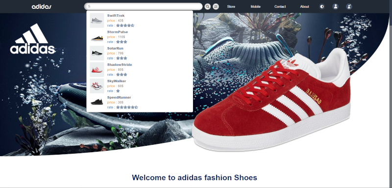
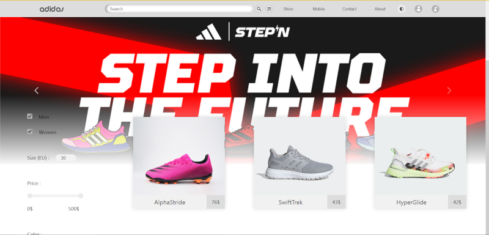 
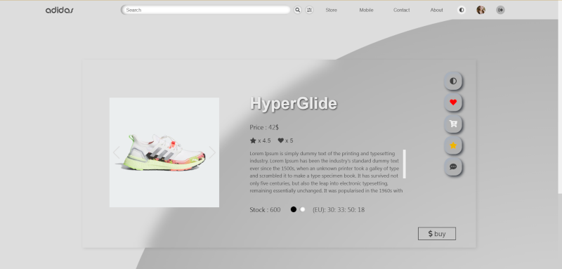
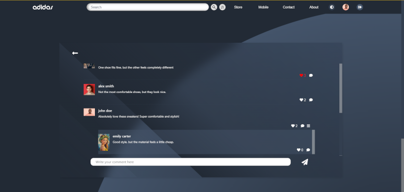 
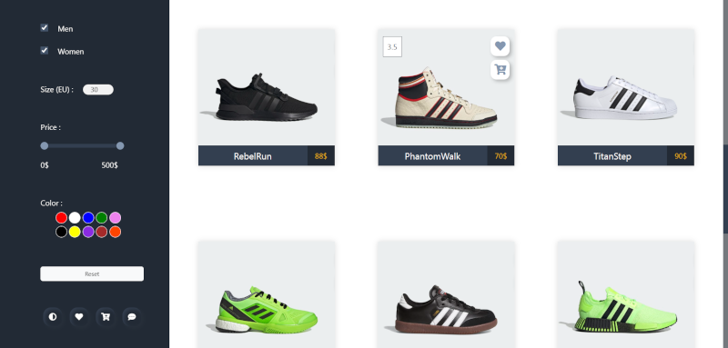
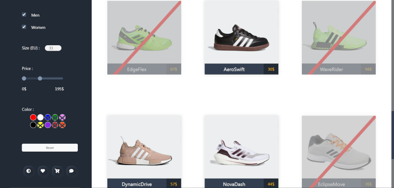 
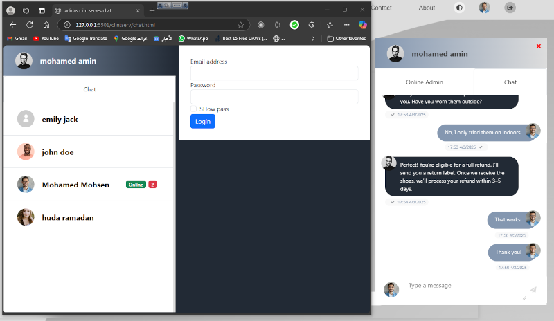
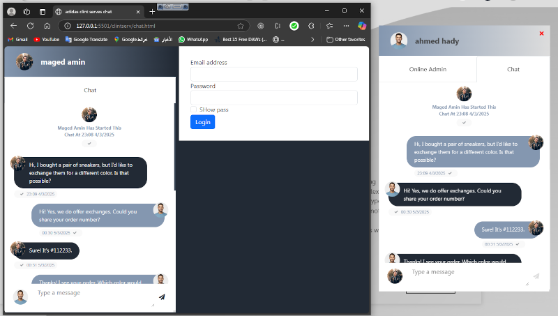 
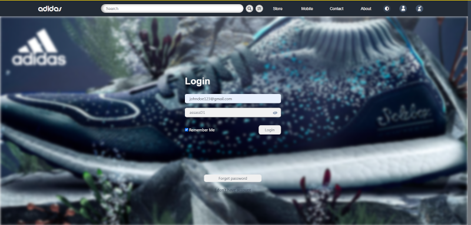
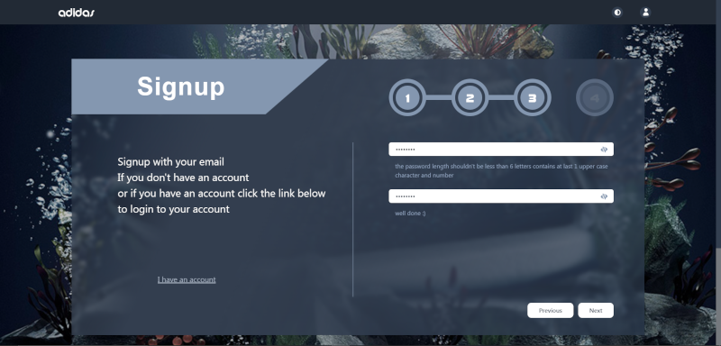 
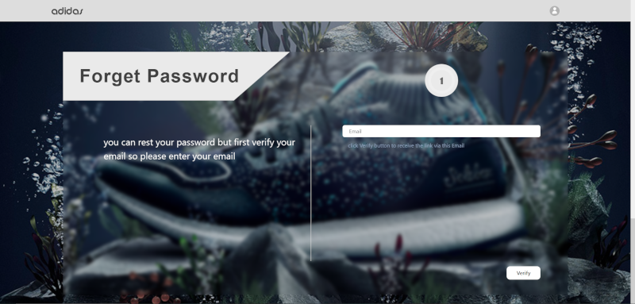
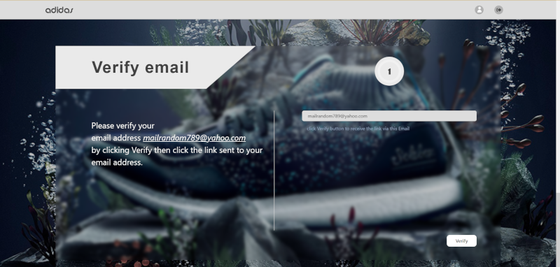 
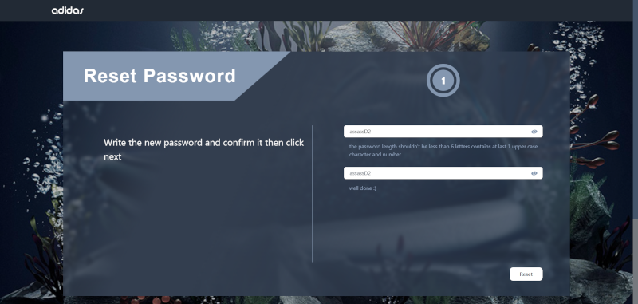
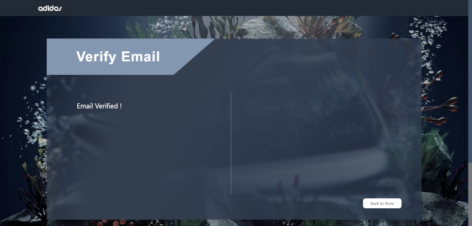 
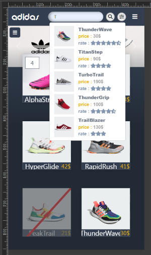
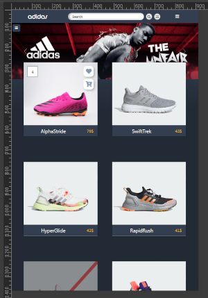
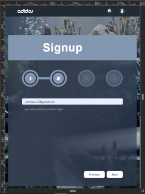

###

<h3 align="left">Site Link</h3>

###

<a href="https://fireauth-d3aef.web.app/">https://fireauth-d3aef.web.app/</a>

###

<h3 align="left">Clint Service Link</h3>

###

<a href="https://adidasclintservtest.vercel.app/">https://adidasclintservtest.vercel.app/</a>

###

###

<h3 align="left">Registered accounts (for try)</h3>

###

<h6 align="left">▶ you can register your own account</h6>

###

<b>#Users : </b><h6>click to open</h6>

 johndoe123@gmail.com assassD1  randomuser456@outlook.com 123456Random  demoaccount123@gmail.net assassD1  alexsmith999@outlook.com assassD1  fakeuseralpha@xmail.net Emily 1234  randommail789@yahoo.com assassD1  accountfake123@gmail.net assassD1  al1e5x5s999@outlook.com assassD1  userfakealpha@xmail.net Emily 1234  mailrandom789@yahoo.com assassD1

<b>#Clint Service :</b> <h6>click to open</h6>

 support1@adidas.com assassD1  support2@adidas.com assassD1

###

###

<h3 align="left">Coded with</h3>

###

  
  
  
  
  
  
  
  
  
  
  
  
  
  
  

###

<h3 align="left">Host</h3>

###

  
  
  

###

<h3 align="left">Contact</h3>

###

  
  
  

###
